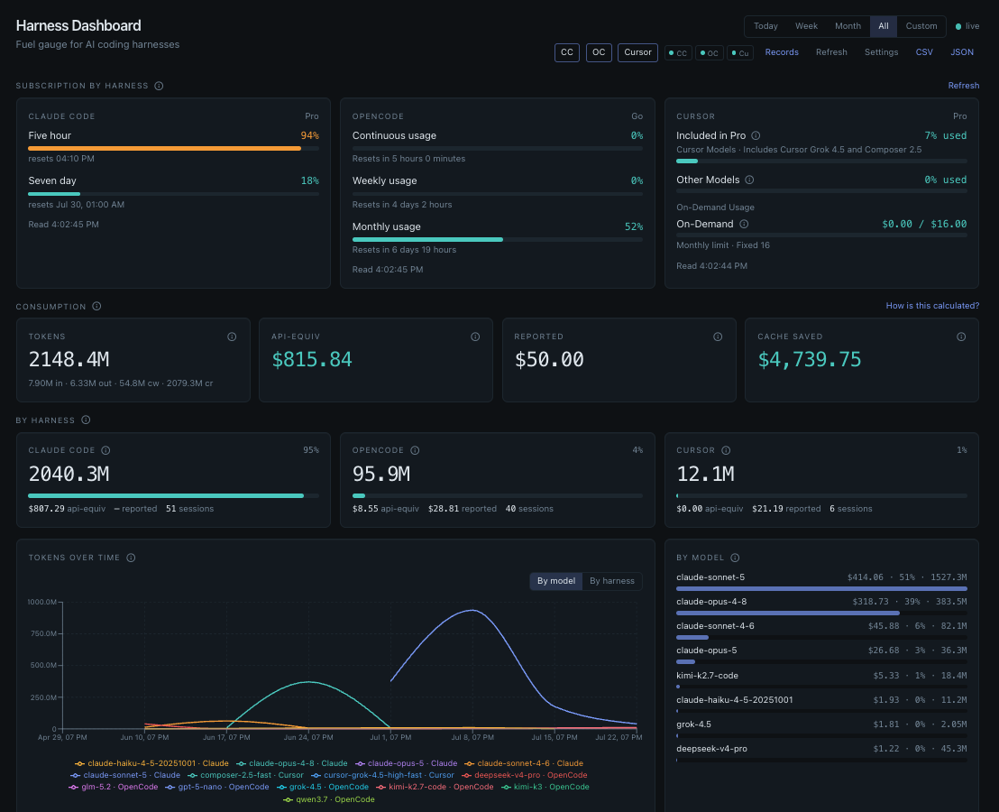

# harness-dashboard

Local-first dashboard for AI coding-harness consumption across **Claude Code**, **OpenCode**, and **Cursor**.

Single user. Runs entirely on `localhost`. No telemetry. No cloud.



> Screenshot: run `bun dev` and capture `http://127.0.0.1:4000` into `docs/screenshot.png`.

## What it does

- Tracks tokens and cost across Claude Code, OpenCode, and (optionally) Cursor
- Shows the active **5-hour window** burn gauge with burn rate and projected depletion
- Weekly usage against a **calibrated** baseline (always marked as an estimate)
- API-equivalent cost vs harness-reported cost, side by side
- Cache savings, model breakdown, what-if swap, export (CSV/JSON)
- Live updates via SSE + `fs.watch`

## Privacy promise

- **Local only** — binds to `127.0.0.1:4000`, never `0.0.0.0`
- **Read-only on harness data** — never writes, moves, or locks a byte inside `~/.claude`, `~/.local/share/opencode`, or Cursor directories
- **Zero telemetry** — nothing leaves your machine unless you enable the optional Cursor adapter (which calls Cursor's own account API with *your* cookie)
- Index lives in `~/.harness-dashboard/` (SQLite + config + pricing cache)

## Install and run

Requires [Bun 1.4.0+](https://bun.sh).

```bash
git clone <repo> && cd harness-dashboard
bun install
bun dev          # http://127.0.0.1:4000
bun start        # production mode
bun test
bun run build    # standalone binary in dist/
```

Port **4000** is fixed — easy to remember, avoids the crowded 3000/8080/5173 range.

## Enabling Cursor (optional, unofficial, fragile)

1. Copy `.env.example` → `.env`
2. Set `CURSOR_SESSION_COOKIE` to your Cursor session token (from browser cookies)
3. Restart the dashboard

The cookie is **never** logged, written to SQLite, returned by any API route, or rendered in the UI.

This path uses an undocumented Cursor account endpoint. It will break without warning. On failure the UI shows: *Cursor session expired. Refresh the cookie in `.env`.* Last good data is kept.

## How cost is calculated

Two numbers, never conflated:

| Number | Meaning |
|---|---|
| **API-equivalent** | What the same tokens would cost at public list rates (LiteLLM pricing, with a bundled offline fallback). Always computed. |
| **Reported** | What the harness itself recorded, when trustworthy. Rendered as `—` when absent. Never fabricated. |

OpenCode often writes `cost: 0` on nonzero-token messages — we treat that as missing, not free.

Cache writes and cache reads are priced separately. Unknown models cost `$0` and appear under an "unpriced models" note.

## Weekly percentages are estimates

Anthropic no longer publishes absolute weekly caps. Configure your plan (`pro` / `max5x` / `max20x`) and a baseline. The ring shows **est.** with a tooltip.

**Calibrate:** when you actually hit a limit, click Calibrate — the current 7-day token total becomes the new baseline (adjusted for plan multiplier).

## Production dependencies

| Package | Why |
|---|---|
| `react` | UI state and composition |
| `react-dom` | DOM renderer for React 19 |
| `react-is` | Peer required by Recharts for element type checks |
| `recharts` | Time-series and bar charts |
| `lucide-react` | Tree-shakeable icons |
| `tailwindcss` | Utility styling (CSS-first v4) |
| `bun-plugin-tailwind` | Tailwind processing inside Bun.serve HTML imports |

## License

MIT
